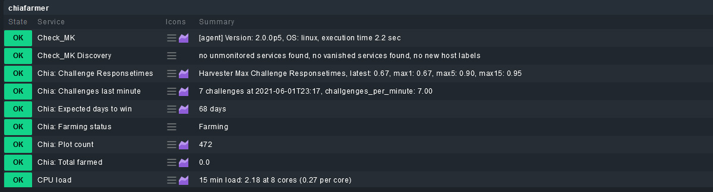
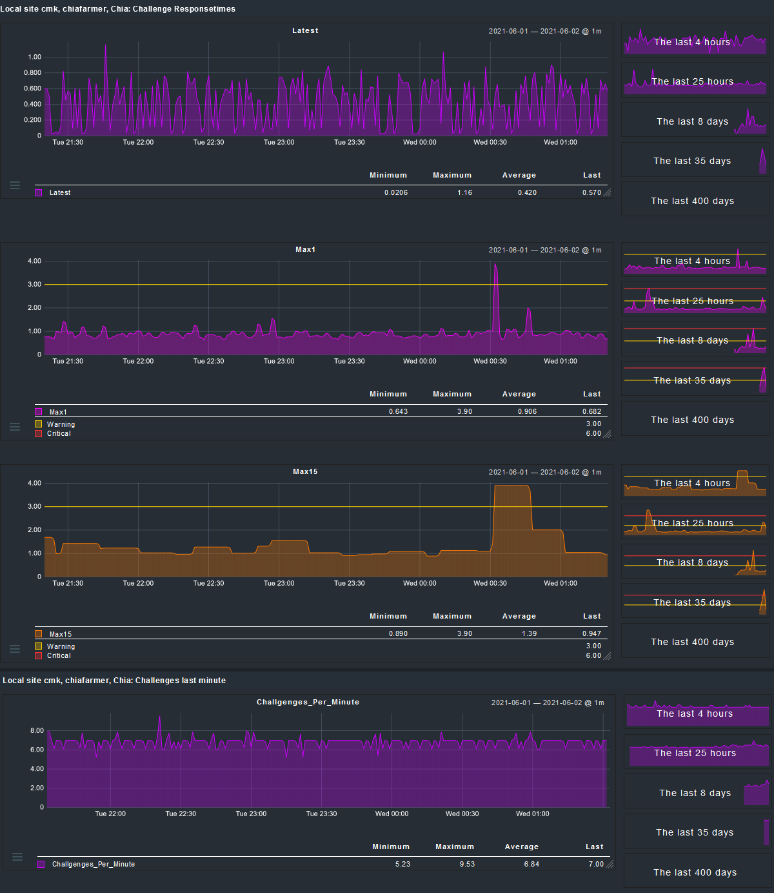

# cmk_chia - CheckMK local checks for chia
Some basic CheckMK [local check](https://docs.checkmk.com/latest/en/localchecks.html) bash scripts to monitor mainly chia farming health.  

###Services

###Graphs

## Install
Copy the scripts you want to use to `/usr/lib/check_mk_agent/local/` or wherever your checkmk-local checkscripts are 
located...
Adjust logfile-locations or executable calls for your needs (usually in line 2 of every script)

## Checks
### farmer/chia_challengecount.sh
checks:
 -  the number of challgenges of the last minute.

### farmer/chia_challengeresponsetimes.sh
checks:
 - the time it took to solve the challges. Reports back the very last and max times for the last 1, 5 and 15 minutes.

### farmer/chia_farmcheck.sh
checks 
 - Farmingstatus
 - Chias farmed
 - Total plots
 - Expected days to win

### misc/chia_versioncheck.sh
*WIP: Not finished, reports rubbish from time to time.* 

checks: 
 - chia version against latest release on github

Has its own folder, bc it can be used on farmers, harvesters, plotters...
Put it [in a subdirectoy](https://docs.checkmk.com/latest/en/localchecks.html#cache) called 3600 
(like `/usr/lib/check_mk_agent/local/3600/chia_versioncheck.sh`)to run it only once every hour, 
to prevent getting hit by Github API Request Limit.

### plotter/plotman_numberofplots.sh
reports:
 - number of running plots

## todo: 
 - swar - number of plots-check